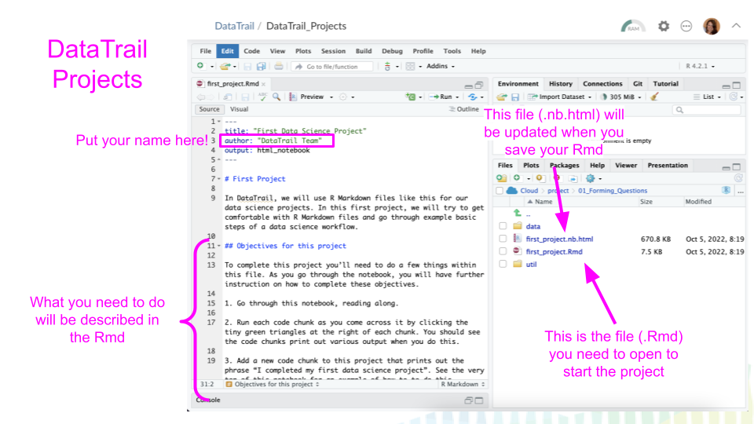

# Your First Data Science Project

We are using this definition of data science.

> "Data science is asking a question that can be answered with data, collecting and cleaning the data, studying the data, creating models to help understand and answer the question, and sharing the answer to the question with other people."

The first step in any data science project is to come up with a question. In this first project, we will go through a question step by step to see what a data science workflow might look like!

### Starting up this project

1. Go to the [DataTrail workspace](https://posit.cloud/spaces/3919/join?access_code=RUUQ-eEgKea0oMF7EJy4UePldyBBMu7d0amv2KFC).
2. Go to the [Data Trail Project list](https://posit.cloud/spaces/3919/content/lists/2065).
3. Go to the `DataTrail_Projects` project in this list. Click on it to start this assignment. For all future projects you will return to this same place to keep working on your projects.
4. When you first start up your `DataTrail_Project`, you might see some red text about packages loading, but that this is normal. 
4. For this project, go to the `01_Forming_Questions` folder.
5. Click on the file `first_project.Rmd` to open this file.

### Your objectives!

To complete this project you'll need to do a few things within this file.  

1. Go through this notebook, reading along. Run each code chunk as you come across it by clicking the tiny green triangles at the right of each chunk. You should see the code chunks print out various output when you do this.

2. Add a new code chunk to this project that prints out the phrase "I completed my first data science project". See the very top of this notebook for an example of how to to do this.

3. At the very top of this file, put your own name in the `author:` place. Currently it says `"DataTrail Team"`. Be sure to put your name in quotes.

4. In the `Conclusions` section, write up responses to each of these questions posed here.

5. When you are satisfied with what you've written and added to this document you'll need to save it. In the menu, go to `File` > `Save`. Now the `nb.html` output resulting file will have your new output saved to it.

6. Open up the resulting `first_project.nb.html` file and click `View in Web Browser`. Does it look good to you? Did all the changes appear here as you expected.

7. Upload your `Rmd` and your `nb.html` to your assignment folder (this is something that will be dependent on what your instructors have told you -- or if you are taking this on your own, just collect these projects in one spot, preferably a Google Drive)!

8. Pat yourself on the back for finishing up your first project!
