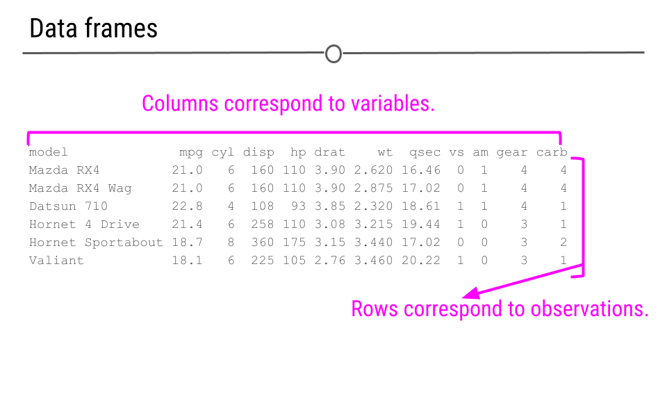
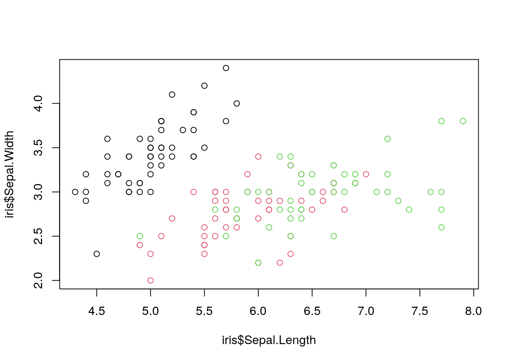

# Data Frames

A majority of the time that you are working with data in R you will have it in the form of a data frame.

Data frames can contain different types of variables in a rectangular format, much like how spreadsheets are.
A data frames' size can be describe in terms of rows (across) and columns (up/down). Rows are often called *observations* and columns are called *variables*.


```r
ottrpal::include_slide("https://docs.google.com/presentation/d/1Q47qnIkVzE-JzCEE5Lm54P6yqReg09QJdr7kiFyCbGc/edit#slide=id.g313d649efe_0_38")
```



\*Much of this chapter is paraphrased or inspired by [content from the Childhood Cancer Data Lab](https://github.com/AlexsLemonade/training-modules/blob/master/intro-to-R-tidyverse/01-intro_to_base_R.Rmd).

## Exploring data frames

In R there are built in data frames that you can use to play with. In this lesson, we will use some of these to get comfortable with data frames.

As a data scientist, one of your main skills will be constantly looking at and evaluating your data! In RStudio, you can see your data frame by clicking on the name of your data frame in the *Environment* pane.

Some useful functions for exploring our data frame include:

- `head()` to see the first 6 rows of a data frame. Additional arguments supplied can change the number of rows.
- `tail()` to see the last 6 rows of a data frame. Additional arguments supplied can change the number of rows.
- `names()` to see the column names of the data frame.
- `nrow()` to see how many rows are in the data frame
- `ncol()` to see how many columns are in the data frame.

Try out these functions to explore your data frame by putting the iris data frame in them.

```
head(iris)

Sepal.Length Sepal.Width Petal.Length Petal.Width Species
1          5.1         3.5          1.4         0.2  setosa
2          4.9         3.0          1.4         0.2  setosa
3          4.7         3.2          1.3         0.2  setosa
4          4.6         3.1          1.5         0.2  setosa
5          5.0         3.6          1.4         0.2  setosa
6          5.4         3.9          1.7         0.4  setosa
```


We can additionally explore overall properties of the data frame with two different functions: `summary()` and `str()`.

The `summary()` function gives us a summary of each variable in the data frame.


```r
summary(iris)
```

```
##   Sepal.Length    Sepal.Width     Petal.Length    Petal.Width   
##  Min.   :4.300   Min.   :2.000   Min.   :1.000   Min.   :0.100  
##  1st Qu.:5.100   1st Qu.:2.800   1st Qu.:1.600   1st Qu.:0.300  
##  Median :5.800   Median :3.000   Median :4.350   Median :1.300  
##  Mean   :5.843   Mean   :3.057   Mean   :3.758   Mean   :1.199  
##  3rd Qu.:6.400   3rd Qu.:3.300   3rd Qu.:5.100   3rd Qu.:1.800  
##  Max.   :7.900   Max.   :4.400   Max.   :6.900   Max.   :2.500  
##        Species  
##  setosa    :50  
##  versicolor:50  
##  virginica :50  
##                 
##                 
## 
```

`str()` function gives us information about the structure and variables included in the `iris` data frame.


```r
str(iris)
```

```
## 'data.frame':	150 obs. of  5 variables:
##  $ Sepal.Length: num  5.1 4.9 4.7 4.6 5 5.4 4.6 5 4.4 4.9 ...
##  $ Sepal.Width : num  3.5 3 3.2 3.1 3.6 3.9 3.4 3.4 2.9 3.1 ...
##  $ Petal.Length: num  1.4 1.4 1.3 1.5 1.4 1.7 1.4 1.5 1.4 1.5 ...
##  $ Petal.Width : num  0.2 0.2 0.2 0.2 0.2 0.4 0.3 0.2 0.2 0.1 ...
##  $ Species     : Factor w/ 3 levels "setosa","versicolor",..: 1 1 1 1 1 1 1 1 1 1 ...
```

### Subsetting data frames

There are multiple ways you can subset your data frame if you want to only look at certain parts of it.

#### $ for extracting columns

Each column in this data frame can behave as a vector and we can easily pull it out from the data frame by using a `$`.


```r
iris$Species
```

```
##   [1] setosa     setosa     setosa     setosa     setosa     setosa    
##   [7] setosa     setosa     setosa     setosa     setosa     setosa    
##  [13] setosa     setosa     setosa     setosa     setosa     setosa    
##  [19] setosa     setosa     setosa     setosa     setosa     setosa    
##  [25] setosa     setosa     setosa     setosa     setosa     setosa    
##  [31] setosa     setosa     setosa     setosa     setosa     setosa    
##  [37] setosa     setosa     setosa     setosa     setosa     setosa    
##  [43] setosa     setosa     setosa     setosa     setosa     setosa    
##  [49] setosa     setosa     versicolor versicolor versicolor versicolor
##  [55] versicolor versicolor versicolor versicolor versicolor versicolor
##  [61] versicolor versicolor versicolor versicolor versicolor versicolor
##  [67] versicolor versicolor versicolor versicolor versicolor versicolor
##  [73] versicolor versicolor versicolor versicolor versicolor versicolor
##  [79] versicolor versicolor versicolor versicolor versicolor versicolor
##  [85] versicolor versicolor versicolor versicolor versicolor versicolor
##  [91] versicolor versicolor versicolor versicolor versicolor versicolor
##  [97] versicolor versicolor versicolor versicolor virginica  virginica 
## [103] virginica  virginica  virginica  virginica  virginica  virginica 
## [109] virginica  virginica  virginica  virginica  virginica  virginica 
## [115] virginica  virginica  virginica  virginica  virginica  virginica 
## [121] virginica  virginica  virginica  virginica  virginica  virginica 
## [127] virginica  virginica  virginica  virginica  virginica  virginica 
## [133] virginica  virginica  virginica  virginica  virginica  virginica 
## [139] virginica  virginica  virginica  virginica  virginica  virginica 
## [145] virginica  virginica  virginica  virginica  virginica  virginica 
## Levels: setosa versicolor virginica
```

Note that `$` work for any R objects that have names. But don't work if there aren't names. when you look at a data frame you will see there are names to the columns. Try using the `colnames()` function to explore the column names of the `iris` data frame.


```r
colnames(iris)
```

```
## [1] "Sepal.Length" "Sepal.Width"  "Petal.Length" "Petal.Width"  "Species"
```

#### Brackets for indexing

Brackets can be used to index data frames or other objects. In the case of data frames, you can subset data frames like below:

In this example, this will extract the second row's data and the 1st column.


```r
iris[2, 1]
```

```
## [1] 4.9
```

Subsetting always goes `[row, column]`.

If we want the whole row or whole column to be extract we can leave the other spot blank like this:

In this example, the first row and all the columns of that row will be extracted.

```r
iris[1, ]
```

```
##   Sepal.Length Sepal.Width Petal.Length Petal.Width Species
## 1          5.1         3.5          1.4         0.2  setosa
```

In this example, all rows of the 3rd column will be extracted.


```r
iris[, 3]
```

```
##   [1] 1.4 1.4 1.3 1.5 1.4 1.7 1.4 1.5 1.4 1.5 1.5 1.6 1.4 1.1 1.2 1.5 1.3 1.4
##  [19] 1.7 1.5 1.7 1.5 1.0 1.7 1.9 1.6 1.6 1.5 1.4 1.6 1.6 1.5 1.5 1.4 1.5 1.2
##  [37] 1.3 1.4 1.3 1.5 1.3 1.3 1.3 1.6 1.9 1.4 1.6 1.4 1.5 1.4 4.7 4.5 4.9 4.0
##  [55] 4.6 4.5 4.7 3.3 4.6 3.9 3.5 4.2 4.0 4.7 3.6 4.4 4.5 4.1 4.5 3.9 4.8 4.0
##  [73] 4.9 4.7 4.3 4.4 4.8 5.0 4.5 3.5 3.8 3.7 3.9 5.1 4.5 4.5 4.7 4.4 4.1 4.0
##  [91] 4.4 4.6 4.0 3.3 4.2 4.2 4.2 4.3 3.0 4.1 6.0 5.1 5.9 5.6 5.8 6.6 4.5 6.3
## [109] 5.8 6.1 5.1 5.3 5.5 5.0 5.1 5.3 5.5 6.7 6.9 5.0 5.7 4.9 6.7 4.9 5.7 6.0
## [127] 4.8 4.9 5.6 5.8 6.1 6.4 5.6 5.1 5.6 6.1 5.6 5.5 4.8 5.4 5.6 5.1 5.1 5.9
## [145] 5.7 5.2 5.0 5.2 5.4 5.1
```

### First plot!

Now that we have some basics down, let's preview how we can easily make visuals with R. "A picture is worth a thousand words" is also true when it comes to data!

In this quick plot example, we can show how `Sepal Length` is related to `Sepal Width` by extracting the data using `$`. Additionally we can color code the data points by `Species` by using the `col` argument.


```r
plot(iris$Sepal.Length, iris$Sepal.Width, col = iris$Species)
```



Don't worry too much about the specifics of plotting. We will go into much more detail about how to make visuals of your data later. This is just to illustrate how R makes data visuals easy to make!
