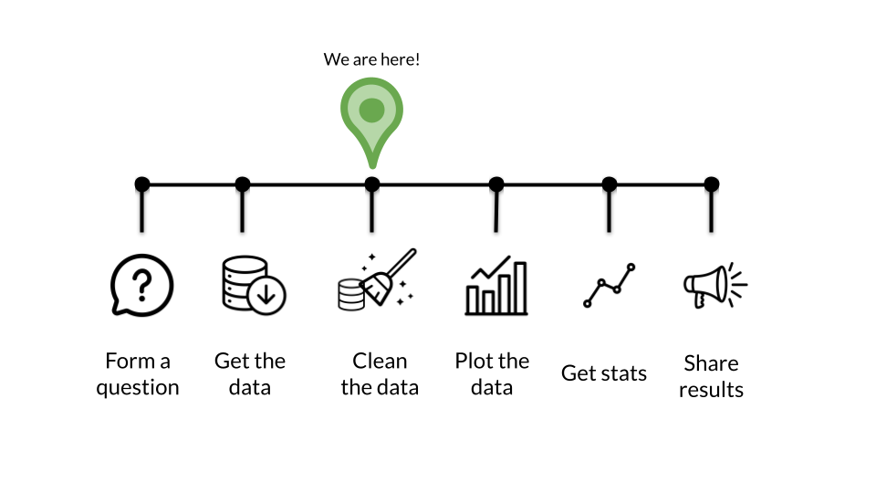

# **Cleaning the Data**

## Learning Objectives

Through the completion of this section our goal is that you will be able to:

- Understand the difference between tidy and untidy dataset
- Clean a dataset so that it is ready for plotting
- Reshape a dataset from long to wide or vice versa
- Manipulate string data in R
- Manipulate factor data in R
- Manipulate dates in R
- Organize your project
- Use good practices for managing your project files
