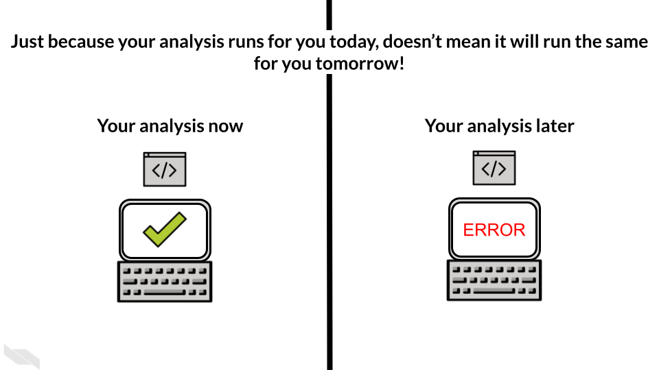
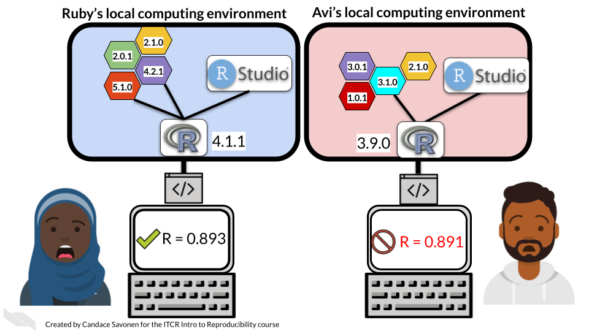

# **Sharing results**


## Learning Objectives

Through the completion of this section our goal is that you will be able to:

- Understand what reproducibility means
- Value the importance of making your analyses reproducible
- Understand the importance of version control
- Navigate GitHub comfortably
- Create a GitHub repository and link it to RStudio Cloud
- Use the basic git command to version control an analysis
- Recognize the different methods available for communicating data science results
- Create a data analysis results report including all the important components
- Give a presentation using Google slides and be able to tailor this presentation for a particular audience
- Create a blog that fosters conversation
- Recognize common expectations for participating in meetings


# Reproducibility

A key aspect of science, and by extension data science, is that it should be consistent. For a finding to be considered scientific, it should be able to be repeated and found again. If you drop the apple and it falls to the ground because of gravity, you should find observe the same thing if you drop the apple again.

The more a scientific result can be found again and again and the inferences from it applied elsewhere, the more we can trust that result! When it comes to a data analysis however, the methods are a bit more involved than dropping an apple. So making a data science result repeatable is not something that happens without a lot of meticulous work and well thought out methods.

- A **repeatable** analysis is one that can be repeated by the **same researcher**, with the _same code_ and _same data_ and achieve the _same result_.

However, a result being repeatable is not enough! As mentioned previously, data science is best done as a part of a community. This means, once you know you can reliable repeat your analysis and get the same result, you will want others to investigate the result for themselves. Other people will be able to see things that you have missed or may have different perspectives that are valuable (another reason why community is helpful in data science). If you can't achieve the same result twice, then others won't be able to replicate your result either.

This means that you want others to be able to take your code and data and be able to re-run your analysis AND achieve the same result!

- A **reproducible** analysis is one that can be repeated by a **different researcher**, with the _same code_ and _same data_ and achieve the _same result_.


## Examples about reproducibility

Let's say that Maria is a data scientist who's found a really cool result in her data. She's very excited about this result, done some polishing and now shares her analysis code and original data with a fellow data scientist, Avi. Avi is going to attempt to re-run Maria's analysis. If he is able to get the same result, then Maria's result will have been reproduced and considered that much more reliable.


Reproducing an analysis result may seem like it should be easy and straightforward. But unfortunately it often is a very frustrating process for the person trying to run someone else's code. Avi in this scenario is struggling to re-run Maria's code.


Perhaps eventually, with some help from Maria, Avi does finally get the code running and the data re-analyzed. Just because code doesn't throw an error doesn't mean it ran the same way or was successful. It's also not uncommon that Avi will obtain a different result. Even if the result is only slightly different, this is worth Maria digging into; because now we don't know whether Maria's run of the analysis or Avi's run is more reliable. And it could be the source of the difference is something we care about.


Reproducibility and repeatability is not only important when working with other scientists, but it's also important working with your future/past self! If you recall, we mentioned one of your closest collaborators is you of yesterday! But past you doesn't reply to emails! This is why working toward reproducible analyses is also so important! It will save future you time and stress.



At this point you may be thinking -- my code runs fine right now, what could possibly happen between now and then that would cause it to break?
We will discuss a variety of aspects of your analysis that you should keep in mind that will affect reproducibility.

### Things that affect reproducibility

#### Usage

A huge and unavoidable variable in data science is humans! Humans make errors all the time (and that is expected!). Sometimes people just make mistakes. Making your analysis reproducible also means trying to account for humans' behavior and minimize the number of areas that are left up to human error.

This means documenting things, automating others, and trying to communicate efficiently. And also sometimes, knowing when to give our brains a rest! (brains get tired and make mistakes more when they are tired).

#### Readable, efficient code

Code that is clear and understandable is more easily able to be troubleshooted, re-run, and repurposed elsewhere. But don't worry about writing perfect code on the first try. Writing code that works is step one in your project. Writing code that works AND is understandable takes more time and work. Some aspects of readable include

##### Use informative variables names

Variables names like `df` or `x` or `tmp` don't tell much about what is stored in there. variable names should give you an idea of what's in there so when you are reading code it is easier to understand!

##### Aim for **DRY code**
\*This section is paraphrased from the [ITCR Intro to Reproducibility course](https://jhudatascience.org/Reproducibility_in_Cancer_Informatics/writing-durable-code.html).

[DRY](https://web.archive.org/web/20131204221336/http://programmer.97things.oreilly.com/wiki/index.php/Don't_Repeat_Yourself) is an acronym: "Don't repeat yourself" [@Smith2013].

> "I hate code, and I want as little of it as possible in our product."

– @Diederich2012

If you find yourself writing something more than once, you might want to write a function, or store something as a variable. The added benefit of writing a function is you might be able to borrow it in another project. DRY code is easier to fix and maintain because if it breaks, its easier to fix something in one place, than in 10 places.  

DRY code is easier to understand because you don't have to read the same thing twice, but also because you don't have to read the same thing twice. ;)

Here's a modified example from @Bernardo2021 for what DRY vs non-DRY code might look like:

```
paste('Hello','John', 'welcome to this course')
paste('Hello','Susan', 'welcome to this course')
paste('Hello','Matt', 'welcome to this course')
paste('Hello','Anne', 'welcome to this course')
paste('Hello','Joe', 'welcome to this course')
paste('Hello','Tyson', 'welcome to this course')
paste('Hello','Julia', 'welcome to this course')
paste('Hello','Cathy', 'welcome to this course')
```

Could be functional-ized and rewritten as:

```
GreetStudent <- function(name) {
 greeting <- paste('Hello', name, 'welcome to this course')
 return(greeting)
}

class_names <- c('John', 'Susan', 'Matt' ,'Anne', 'Joe', 'Tyson', 'Julia', 'Cathy')

lapply(class_names, GreetStudent)
```

Now, if you wanted to edit the greeting, you'd only need to edit it in the function, instead of in each instance.

- [DRY Programming Practices](https://metova.com/dry-programming-practices/) by @Klinefelter2016.  
- [Keeping R Code DRY with functions](https://www.youtube.com/watch?v=XSRO4VKD-pc) by @Riffomonas2021.  
- [Write efficient R code for science](https://www.earthdatascience.org/courses/earth-analytics/automate-science-workflows/write-efficient-code-for-science-r/) by @Joseph2017.  

##### Code that follows a style

As discussed elsewhere, code is much easier to read if it follows a style. Much like how sentences are easier to read if they follow punctuation and grammar conventions.

#### Frequency of re-running code

What's a simple way to know if your analysis will re-run? Re-run it _all the time_ while you are developing it. As we've mentioned, if you can't run your analysis, other people won't be able to for sure. But if you can reliably re-run your analysis then you are well on your way!

This is also a very handy development skill. Frequently re-running your code, especially in the early development stages of your code, can help you catch problems earlier before they get out of control!

Second step of this is having others try to understand, evaluate, run and re-run your code -- after all that is the true test of reproducibility!

#### Documentation

As you are in the thick of writing your analysis, everything probably makes perfect sense to you. But if you come back to it a week after not looking at it, would you know where you left off? What about a month later? A year?

Documentation is a great tool to combat irreproducibility. Not only can documentation save future you time and frustration but it can also help others get going and help with your project. Do you remember how we talked about READMEs? They are a crucial part of making a reproducible analysis. Code comments are also crucial!


Err on the side of over-documenting! You can save yourself so much time!

#### Manual steps

Pointing and clicking to do a thing can be tempting to do when you are just trying to get a thing done. But if it is a critical step in the analysis _don't do it_! Every step that is needed to re-run an analysis should be in a script. Ideally to re-run your analysis you will have one main script that will run the whole thing by one command.

If a step absolutely can't be done through a script, then the next best thing is to document the heck out of that step and put it in large bold letters! See the above section about documentation.

#### Software and package versions

Software and library packages are always being developed. Not only does your own use of your computer mean that you are probably updating things on your computer all the time, but even if you don't change anything on your computer. Software and packages deteriorate and are **deprecated** over time as things are continually being developed on the world wide web.

These packages influence how your analysis runs and ultimately your final results. Let's return to our example of Maria and Avi. It's very likely that the reason Avi might get a slightly different result when he re-runs Maria's analysis is that he has different software packages and versions installed on his computer.

Maria developed her analysis on her computer with a variety of different software packages and versions installed. It is impossible that Avi has the same exact set up on his computer by chance.



So how can you keep this from totally breaking your code? Well short answer is you can't fully. But you can do things to help. One thing is printing out session info (Something we've been trying to illustrate in examples throughout the course). How does session info help? If we have both Maria and Avi's session info we can compare them! This helps give us clues as to why they may have gotten slightly different results. We can further dig into these package version differences and try to pinpoint what happened that influenced the results.


We can further dig into these package version differences and try to pinpoint what happened that influenced the results.

#### Data changed

Did the data get updated and we missed that? If so that's a very understandable reason for a result not being reproducible. Just make sure to look into those data changes and see if that means your analysis should be altered at all. Also what are the reason for those data changes. Digging into questions like these is a skill that you want to build on for improving your data science skills!

#### File organization

As discussed elsewhere, file organization is a big part of making a project understandable and also reproducible! Keep your organizational schemes in mind. And remember that organizing your files is a great use of time and crucial to a successful and reproducible project!

#### Version control

The last thing on this list is what we are going to build on for a lot of this next section. As you are working on your files, you will likely find they will change a lot. You may have a tendency to want to keep all the different iterations of your analysis. But this can lead to some organizational problems.


Today you might remember which file was particularly important for different things, but future you might have no idea what today you was up to. It's great to keep a record of files and how your analysis has developed, but how do you keep it from becoming unruly?

The antidote for this problem is version control. We will give you the methods and techniques for using version control for your project. Version control is a method of tracking files throughout the development of your project. We will cover this more in this section.

#### Share you code

If you want to know if others can run your code, the best way to find out is to ask others! Others can help you improve your analysis and see things you didn't notice. Data science is done best as a community activity! We will discuss tactics for this goal as well!

## Reproducibility doesn't happen overnight!

This may sound overwhelming to implement. But don't fear! A reproducible analysis is not written on the 1st try (or the second, third fourth... 10th edits to your analysis). No analysis is perfect! The idea here is to encourage you to think about these things and work on them iteratively, over time so that the analyses you work on will become more and more reproducible sooner into your projects.


No analysis is perfect! But the best advice for making your analyses more reproducible is by working with other data scientists! Share your results and ask lots of questions! After all, data science is all about questions!

### Additional Resources

* [Building a Data Pipeline from Scratch](https://medium.com/the-data-experience/building-a-data-pipeline-from-scratch-32b712cfb1db), by [Alan Marazzi](https://www.rdisorder.eu/)
* [Parameterized R Markdown reports with RStudio Connect](https://www.rstudio.com/resources/videos/parameterized-r-markdown-reports-with-rstudio-connect/)
* [RMarkdown Parameterized Reports](https://rmarkdown.rstudio.com/developer_parameterized_reports)
* [Chapter 15: Parameterized Reports in R Markdown: The Definitive Guide](https://bookdown.org/yihui/rmarkdown/parameterized-reports.html), by Yihui Xie, J.J. Allaire, and Garrett Grolemund
