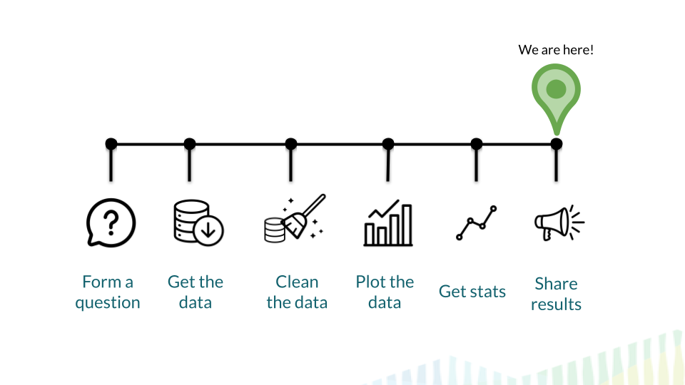

# (PART\*) Sharing Results {-}

# **Sharing Results**

## Learning Objectives

Through the completion of this section our goal is that you will be able to:

- Understand what reproducibility means
- Value the importance of making your analyses reproducible
- Understand the importance of version control
- Navigate GitHub comfortably
- Create a GitHub repository and link it to RStudio Cloud
- Use the basic git command to version control an analysis
- Recognize the different methods available for communicating data science results
- Create a data analysis results report including all the important components
- Give a presentation using Google slides and be able to tailor this presentation for a particular audience
- Create a blog that fosters conversation
- Recognize common expectations for participating in meetings
