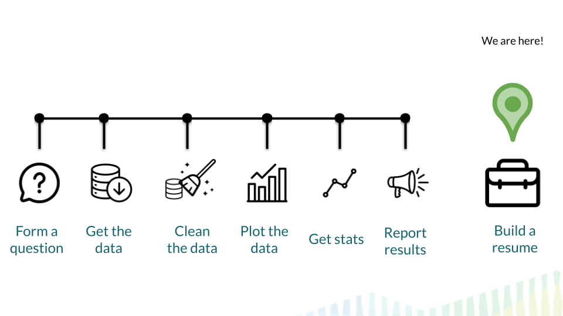

# **Building a resume**

## Learning Objectives

Through the completion of this section our goal is that you will be able to:

- Build a resume and understand what features are a part of an effective resume
- Make your own professional website
- Show off the great work you've done!
- Use Twitter to build connections with the data science community
- Find data science job openings
- Communicate effectively in an interview and conduct a presentation
- Meet up with data science individuals online or in person

## What You Need to Find a Data Science Job

Whenever you're looking for a job, in data science or otherwise, there are a number of things that you're required to submit to officially apply for a job, such as a cover letter and a resume.

However, for data science jobs, there are a number of other steps you should take *outside of what you submit to each company* to give yourself the best chance at getting the job you're interested in! These include ensuring you have a personal website and that it is up to date and ensuring that all your professional social media accounts are up-to-date!

In this lesson, in particular, we'll cover an overview of what you need to find a data science job. And, then, in the lessons that follow, we'll discuss the ins- and outs- of those official documents (resume, cover letter, etc) and those less official steps to take (updated website, Twitter presence, etc.), helping to ensure you get each of these set up to move forward. Note that there will be *a lot* to do throughout this course, but that's what it takes to get a job! So, read carefully, follow along, and make all the updates and changes outlined throughout this course to start preparing yourself for looking for a position!

### Job Applications

When applying to jobs, they minimally will require you to submit a **cover letter** and a **resume**.

#### Resumes

Resumes are (typically) one page documents that **include how to contact you along with information about your education, skills, and experience**. They are meant to be read at a glance, so they should be brief, clear, well-formatted, and include only the essential information.

#### Cover Letters

In addition to a resume which will not change much from one job application to the next, you will also submit a cover letter. A cover letter is supposed to convey both **why you're interested in the job** to which you're applying *and* **why you'd be a great fit** for that job. These should also not exceed one page.

### Online Presence

In addition to the *official* job application materials, the individuals responsible for hiring decisions at the company where you're submitting your application will have access to the Internet. This means that if you get through their initial screening, where they look at your cover letter and resume, they'll likely search for you on the Internet.

This means that your **online presence should always be up to date when you're applying for jobs**.

#### Personal Website

You will want to have a personal website. With GitHub this is not too difficult (and its free). We'll guide you on how to set this up!

#### Social Media

In addition to a personal website it will be important to have your GitHub, LinkedIn and Twitter profiles up-to-date. Briefly here we'll discuss why this is important and in the lessons in this course, we'll walk through the steps necessary to take to get everything ready for applying to jobs.

* GitHub - hiring managers will look here to see work you've done *and* how much you've worked with others
* LinkedIn - is a great place to get more details beyond what is included on your resume
* Twitter - is where you'll want to share your work *and* support the work of others

It's important that each of these profiles are up-to-date, contain all the information hiring managers would want to see, and are easy to find. We'll make sure you're all set with this throughout this course!

### Additional Resources

* [How to be a modern scientist](https://leanpub.com/modernscientist), by Jeff Leek
